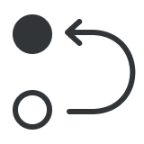
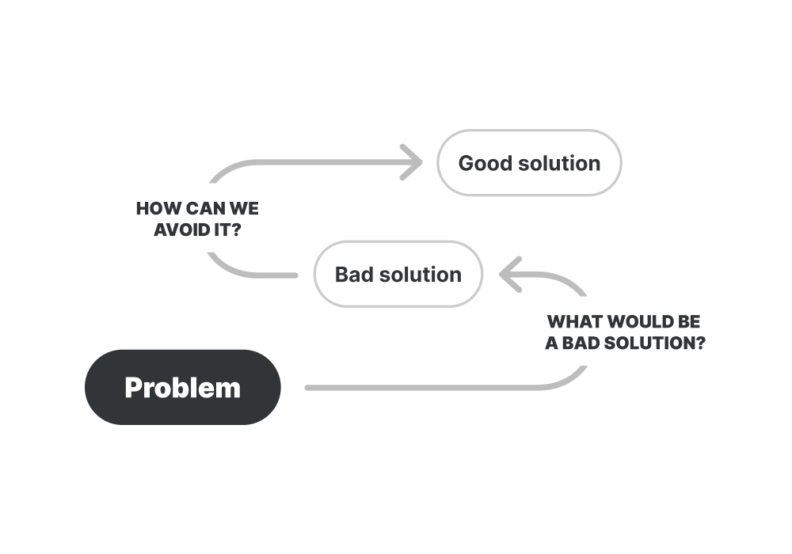

## Inversion

**PROBLEM SOLVING**

Approach a problem from a different point of view.

Inversion is useful when you need to view the problem you're solving from a different angle. It can help you see a different perspective and imagine worst-case scenarios.

## How to use it?

A good trigger question to know if inversion can help you is "Am I only thinking of ideal solutions or scenarios?"

You can then invert your thinking about the problem or a solution. To do that, follow these steps:

1. Ask yourself: What would be the worst decision/solution in this situation?
2. Ask yourself: Why would it be bad? Write those reasons down.
3. Try to come up with a good decision/solution, now by looking at the reasons that would make a bad decision.

Inversion helps you see the bad outcomes and therefore avoid them.

More questions that could help you see the inverted perspective are:

- How could this go wrong?
- What would the opposite of this be?
- What would make a bad solution to this?

## Inversion in practice

Project managers use inversion in an exercise called pre-mortem. 

The team gathers to imagine it's six months from now and the project they've worked on has failed. They examine this potential scenario by asking questions like "What went wrong?", "What mistakes did we make?" or "Why did this project fail?".

This makes the team see potential pitfalls ahead of time and prepare for them. By using inversion, they're able to avoid possible mistakes and bad outcomes.

### Sources

["Mental models for designers" by Wes O'Haire](https://dropbox.design/article/mental-models-for-designers)

["Inversion" by James Clear](https://jamesclear.com/inversion)

