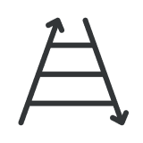

## Ladder of inference

**DECISION MAKING**

Avoid jumping to conclusions. Make decisions based on reality.

We act and make decisions based on the conclusions we make. But we tend to jump to these conclusions and skip important parts of the reasoning process.

Ladder of inference, developed by a former Harvard professor Chris Argyris, is a tool that helps you fill the gaps in your thinking and make decisions based on reality. It's also helpful to challenge the thinking of others and reach better conclusions together.

## The ladder

There are 7 steps on the ladder that represent our mental processes. Here's what it looks like from the bottom up:

1. Available data
   - This is the reality we are able to observe.
2. Selected data
   - We select what we pay attention to based on our prior experiences and existing beliefs. We don't have the mental capacity to take in every piece of data available, so we have to make this selection.
3. Interpretations
   - We give facts meaning. We paraphrase what we see or hear to make sense of it.
4. Assumptions
   - Based on our interpretation, we make our own personal assumptions.
5. Conclusions
   - We draw conclusions from our assumptions.
6. Beliefs
   - Our beliefs are then developed from the conclusions we make.
7. Actions
   - Finally, we take actions that are rooted in what we believe to be true.

These processes usually happen unconsciously and very quickly in our brain. Applying this ladder consciously allows you to take a step back and see where you're jumping to conclusions.

## How to use it

Whenever you make a conclusion about something or are making decisions based on your conclusions, it's good to stop and question your reasoning.

First, identify on which step of the ladder you currently are. Are you about to take action and you're not sure if it's the right one? Or perhaps you're aware of some of the assumptions you're making?

Then work your way down before building your reasoning up again. To work your way down the ladder, use these guiding questions for each step:

- Actions:
  - Why do I believe this to be the right action? What are some alternative options?
- Beliefs:
  - What beliefs do I hold about this? What conclusions are they based on?
- Conclusions:
  - Why did I conclude this? What are my assumptions there?
- Assumptions:
  - Are my assumptions valid? Why am I assuming this? 
- Interpretations:
  - Am I looking at this data objectively? What other meanings could they have?
- Selected data:
  - What did I ignore or didn't pay attention to? Are there other sources of data I didn't consider?

As you answer these, you may find that your reasoning changes along the way and that's good. When you reach the bottom of the ladder, work your way back up again, this time more consciously and deliberately.

## Example

Let's see how applying the ladder of inference looks like on a practical example.

Suppose I'm managing a team of developers. One of them hasn't been performing well recently. He's been missing deadlines and several projects were delayed because of this. I conclude he's not cut out for the job and decide to fire him.

However, I stop and ask myself: Is this the right thing to do? I can now apply the ladder of inference to unpack my thinking and perhaps make a better decision. I ask myself the guiding questions:

- Why do I believe that firing this person is the right action? Because it's clear to me he's not right for the job.
- What conclusions is this belief based on? That he's not a good developer.
- What are my assumptions here? I assumed that his recent results are representative of his qualities (or lack thereof).
- Why am I assuming this? Because missed deadlines mean he's not efficient.
- What other meanings could the data I'm looking at have? Missed deadlines might also mean the deadlines are unreasonable or he's taking extra time to deliver quality code.
- Are there other sources of data I didn't consider? I haven't asked him directly yet. When I do, I might find out the real reason he's been missing deadlines.

This is a simplified example but it shows the kind of jumping to conclusions I want to avoid: *missed deadlines → inefficient → not a good developer → should be fired*. By unpacking my thinking, I can look at the situation more objectively and I may discover different reasons for what's happening: perhaps the deadlines are too tight or he's going through some personal issues. Neither of which should be a reason to fire him.

The ladder of influence has just helped me avoid making a bad and premature decision.

## Put it to practice

I created a handy worksheet to help you put this tool into practice. It comes with a simple how-to guide including an example.

Print out the PDF or fill it in digitally and use it to make better decisions:

[Get the worksheet](https://gumroad.com/l/untools-worksheets)

Preview of the worksheet and guide:

### Sources

["The Fifth Discipline: The Art & Practice of The Learning Organization" by Peter Senge](https://www.goodreads.com/book/show/255127.The_Fifth_Discipline)

["Rethinking thinking" by Trevor Maber](https://www.youtube.com/watch?v=KJLqOclPqis)

["The Ladder of Inference" on Systems Thinker](https://thesystemsthinker.com/the-ladder-of-inference/)